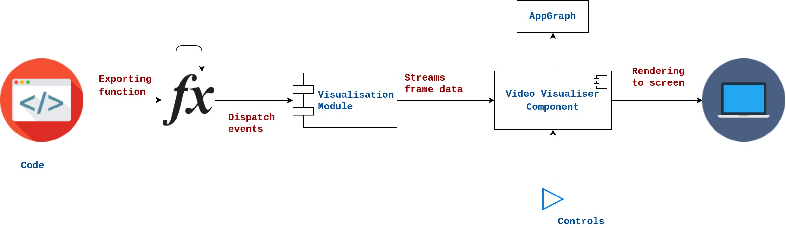
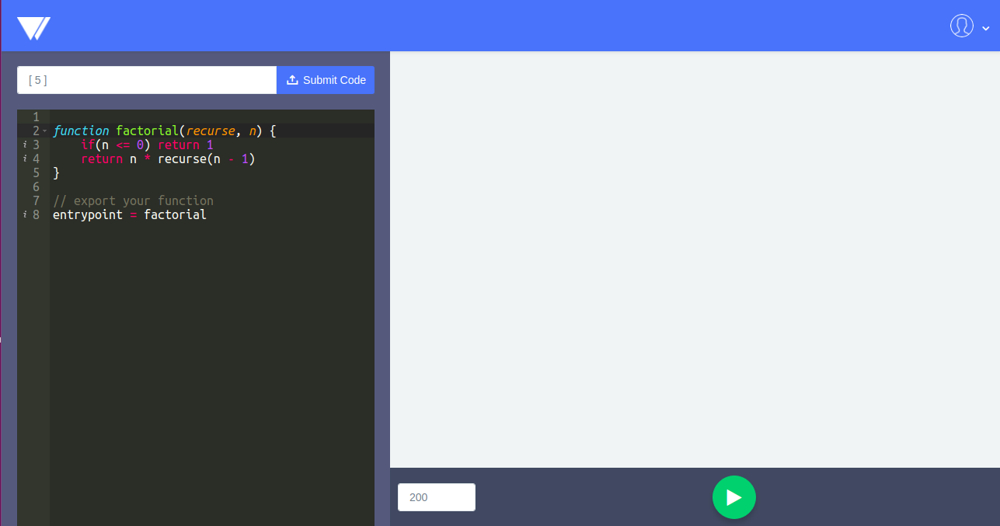
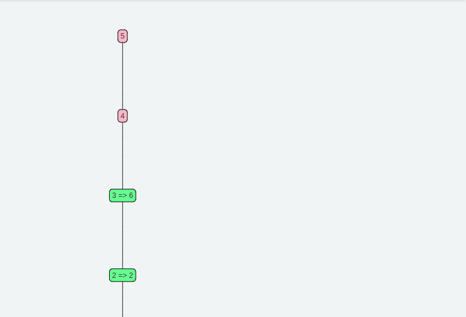
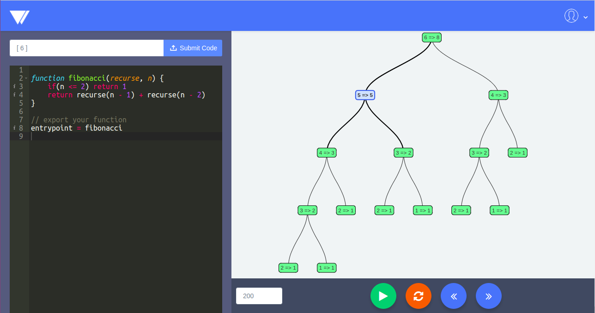

# Recurse-and-C

When we study recursive functions, we all wish we could visualise and watch them run step-by-step and then rewind and rerun the code. In this way we can gain better insights on how recursive functions works and when it stops. This will also help teachers explain the basics of recursion in a better manner.

## Installation

* Clone the repository `https://github.com/sayak119/Recurse-and-C`.
* Run `npm install`.
* Run `npm start`.

## UML diagram

 

## Screenshots

* Factorial

  

  

* Fibonacci

  

## YouTube video
